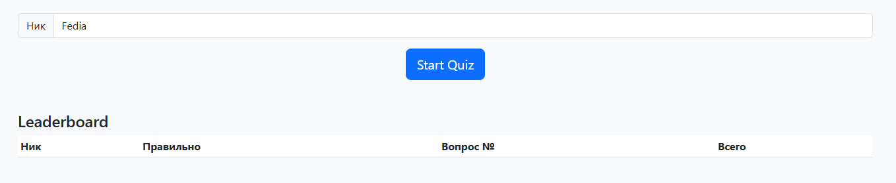
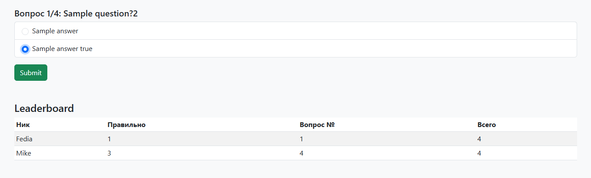
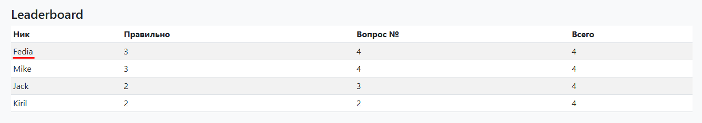
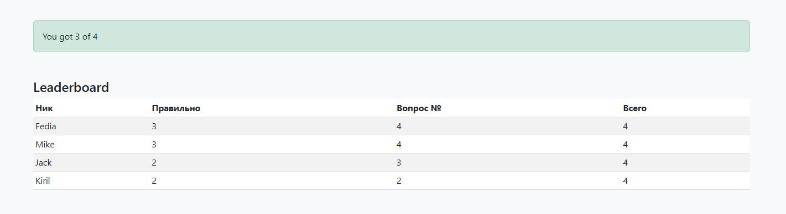

# Real Time Quiz Hub

**ASP .NET Core + SignalR quiz with live leaderboard**

---

## ⚙️ Quick Start

1. **Clone repo** to solution root (folder with `.git` and `.sln`):

   ```bash
   git clone https://github.com/yourusername/RealTimeQuizHub.git
   cd RealTimeQuizHub/RealTimeQuizHub
   ```
2. **Add SignalR** (if needed):

   ```bash
   dotnet add package Microsoft.AspNetCore.SignalR
   ```
3. **Run**:

   ```bash
   dotnet run
   ```
4. **Open** in browser: `https://localhost:5001`

---

## 📁 Folder Setup

```
RealTimeQuizHub/        ← solution root
├─ RealTimeQuizHub/     ← project
│  ├─ Hubs/
│  ├─ Services/
│  ├─ wwwroot/
│  │  ├─ css/
│  │  ├─ js/
│  │  └─ index.html
│  ├─ Program.cs
│  └─ ...
├─ README.md            ← this file
└─ screenshots/         ← create this folder
```

---

## 🖼️ Screenshots (in `/screenshots`)

Capture and save these PNGs:

1. **quiz\_start.png**

   * Input nickname & **Start** button
   * Mark input field and button with red rectangles
     

2. **quiz\_question.png**

   * One question with answer options
   * Annotate selected answer in green
     

3. **leaderboard\_live.png**

   * Leaderboard table while quiz runs
   * Highlight row of your nickname
     

4. **final\_result.png**

   * Result screen after quiz end
   * Box the result message
     

5. **project\_structure.png**

   * Visual Studio Solution Explorer
   * Frame the `wwwroot`, `Hubs`, `Services` folders
     

---

## 🔧 How It Works

* **RegisterUser**: client sends nickname → server adds to in-memory list
* **StartQuiz**: API `/api/quiz/start` delivers first question
* **SubmitAnswer**: client posts answer → server updates session → client invokes `UpdateProgress` on hub
* **BroadcastLeaderboard**: hub pushes updated scores to all

---

## 📦 Commit & Push

```bash
git add README.md screenshots/
git commit -m "Add README with screenshots instructions"
git push origin main
```
