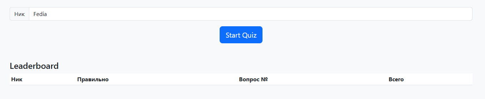
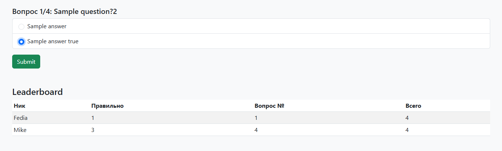
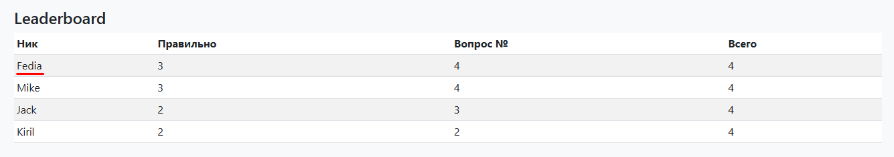
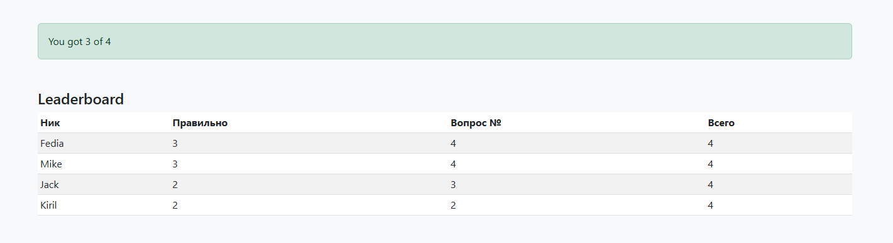

# Real Time Quiz Hub

**ASP .NET Core + SignalR quiz with live leaderboard**

A lightweight quiz application showcasing real-time updates, in-memory session management, and a responsive Bootstrap UI. Perfect for learning SignalR, building live features with a database, and demonstrating modern .NET skills in a concise codebase.

---

> 🛠️ **Managing Questions**: Quiz questions can be added, updated, or removed via the built-in Swagger UI at `https://localhost:5001/swagger`. Use the `/api/quiz` endpoints to manage your question set dynamically.

---

## ⚙️ Quick Start

1. **Clone repo** to solution root (folder with `.git` and `.sln`):

   ```bash
   git clone https://github.com/Ururu221/RealTimeQuizHub.git
   cd RealTimeQuizHub/RealTimeQuizHub
   ```
2. **Add SignalR** (if needed):

   ```bash
   dotnet add package Microsoft.AspNetCore.SignalR
   ```
3. **Run**:

   ```bash
   dotnet run
   ```
4. **Open** in browser: `https://localhost:5001`

---

## 📁 Folder Setup

```
RealTimeQuizHub/        ← solution root
├─ RealTimeQuizHub/     ← project
│  ├─ Hubs/
│  ├─ Services/
│  ├─ wwwroot/
│  │  ├─ css/
│  │  ├─ js/
│  │  └─ index.html
│  ├─ Program.cs
│  └─ ...
```

---

## 📸 Screenshots

1. **Start Quiz**
   

2. **Answer Question**
   

3. **Live Leaderboard**
   

4. **Final Result**
   

---

## 🔧 How It Works

* **RegisterUser**: client sends nickname → server adds to in-memory list
* **StartQuiz**: API `/api/quiz/start` delivers first question
* **SubmitAnswer**: client posts answer → server updates session → client invokes `UpdateProgress` on hub
* **BroadcastLeaderboard**: hub pushes updated scores to all

---

